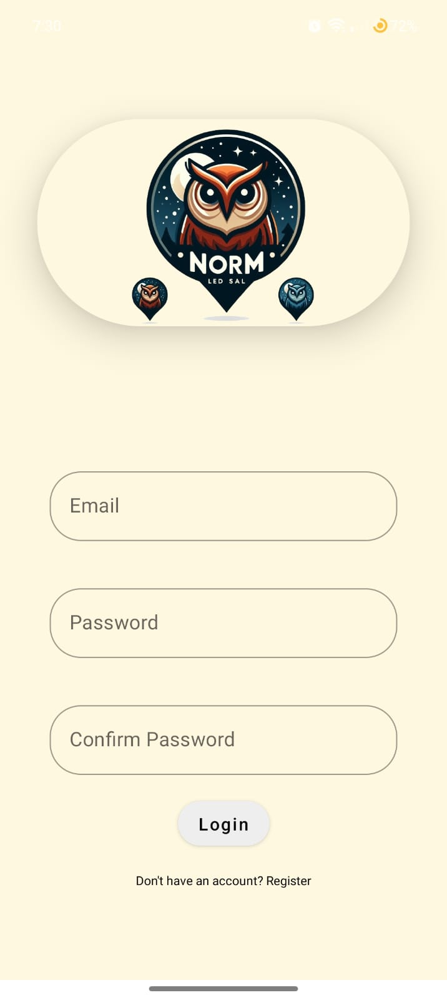
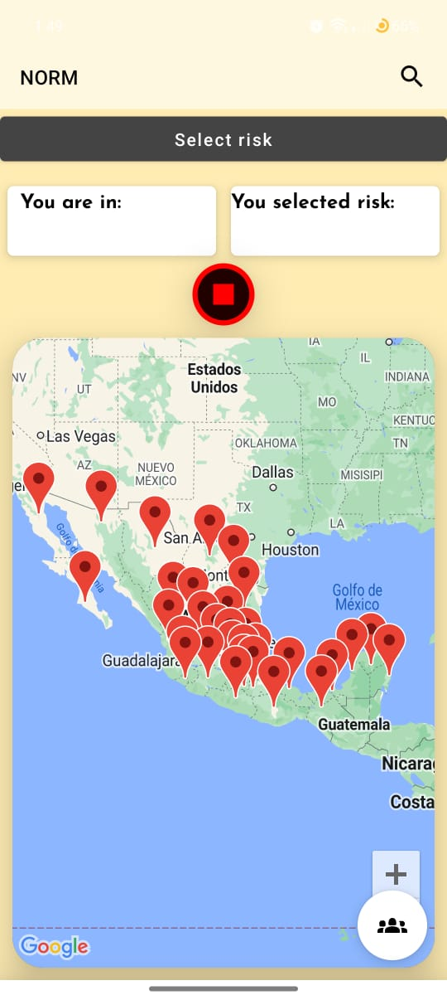
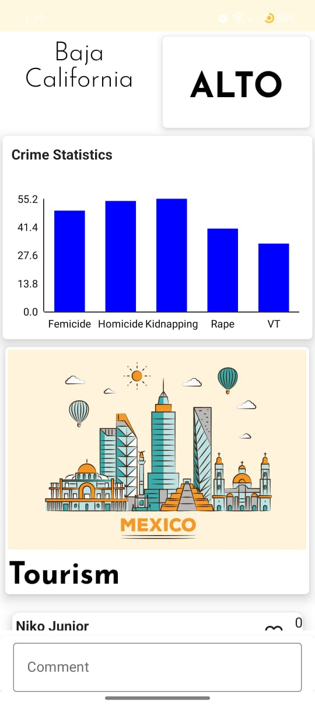
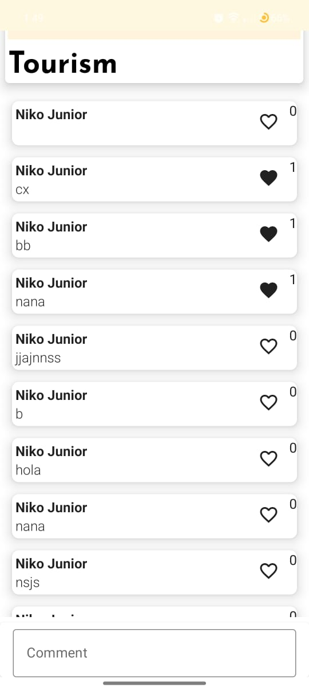
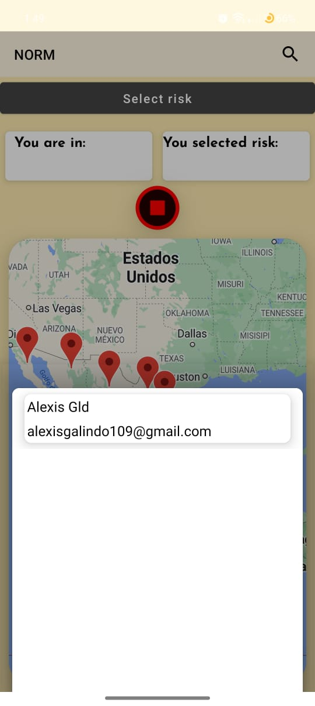
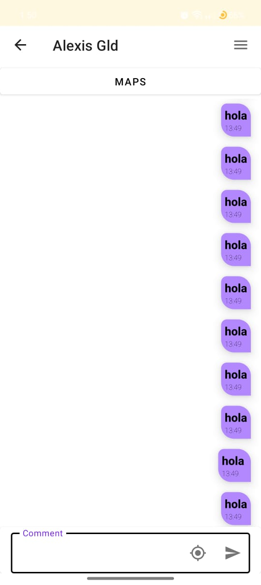
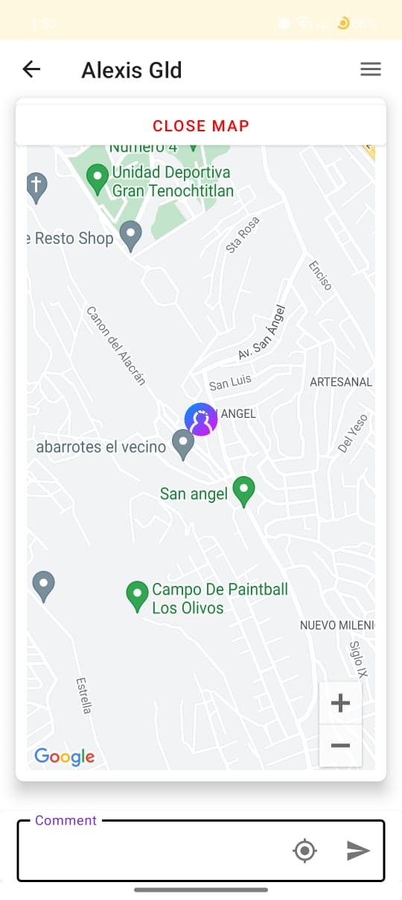

| Descripción | Captura de pantalla |
|-------------|---------------------|
| Login que requiere los datos principales para acceder a la app. |  |
| Pantalla principal de la aplicación, donde puedes seleccionar un estado de México; posteriormente mostrará información acerca de ese estado. |  |
| En la información del estado se podrán ver datos como delincuencia, secuestros, robos, etc. |  |
| En la parte baja de la misma pantalla del estado, podrán escribir y dar "like" a comentarios acerca del estado seleccionado. |  |
| Regresando a la pantalla principal, se ubica un botón flotante, el cual contiene a los amigos registrados por la persona. |  |
| Al seleccionar un amigo enviará a un chat en el cual se podrá comunicar con la persona. |  |
| En el mismo chat se podrá visualizar un mapa donde estará mostrando la ubicación de la persona solo con activar la ubicación. |  |
